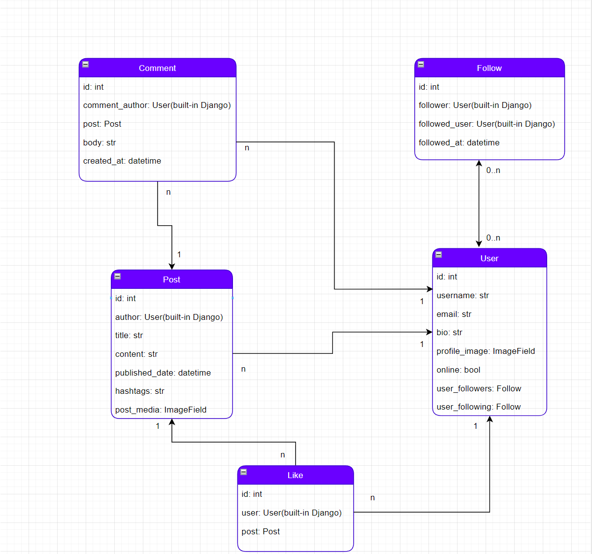
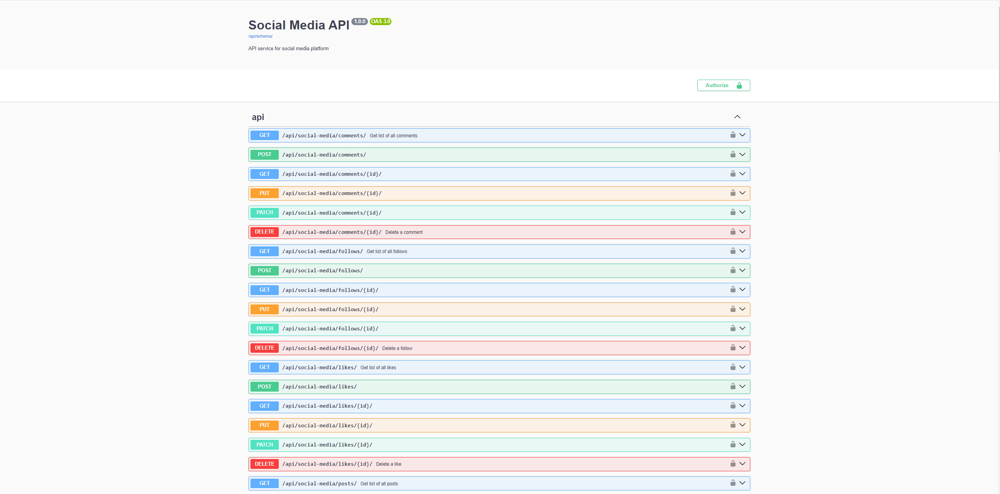
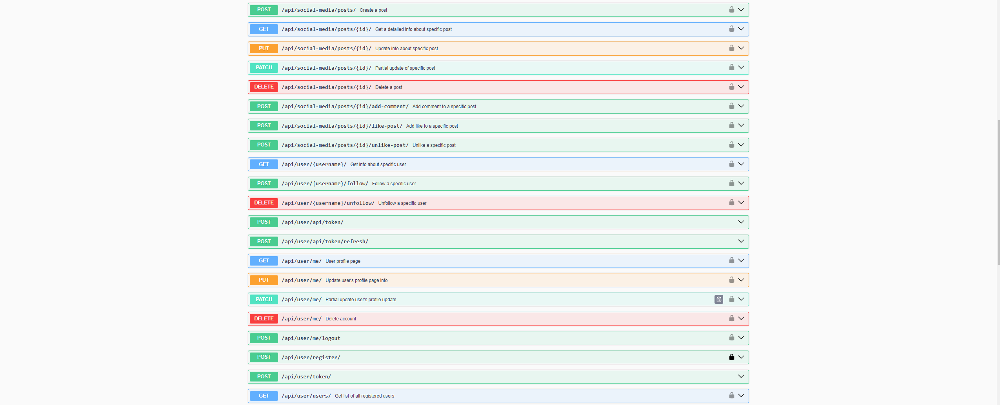

# Social Media

## About project:


This is the Social Media API platform for creating amd managing user accounts,posts,comments,likes/unlikes, follows/unfollows.
It provides a comprehensive set of features for building a social media application, including user authentication, profile management, post creation and interaction, comment threads, and user following capabilities. The API is built using Django and Django REST framework, ensuring reliability, scalability, and security for your social media application."

### Technologies that were included to this project:

1. **Django REST Framework**: For managing API views.
2. **PostgreSQL**: As the main database.
3. **Docker Compose**: For developing the microservices.
4. **Swagger**: For API documentation.


## The main features:

* JWT authentication.
* Admin panel /admin/.
* Allow users to create and manage their profiles,view another users profiles,see users online status,view the number of followers and following users, and update profile information and upload profile pictures.
* Post Creation and Management: Enable users to create, edit, and delete posts. Posts can include text, images, hashtags,total likes.
* Commenting on posts.
* Liking/unliking posts.
* Following and unfollowing other users.
* Different types of filtering.
* Search Functionality: Implement a search feature that allows users by their username.
* Customizable permissions and access control.
* Recording and managing orders made by users, and handle tickets for specific flights and orders, including row and seat details.

### How to run:
#### Using Docker

- Copy .env.sample -> .env and fill with all required data
- `docker-compose up --build`
- Create admin user (Optional)
- `docker-compose exec -ti social_media python manage.py createsuperuser`

#### Using GitHub
```bash
git clone https://github.com/mwellick/social-media-api.git
cd social-media-api/social_media_api
python -m venv venv
source venv/bin/activate
pip install -r requirements.txt

# Apply migrations and run the server
python manage.py migrate
python manage.py runserver
```

## Demo






## Copyright
Copyright (c) 2024 Michael Korotia
